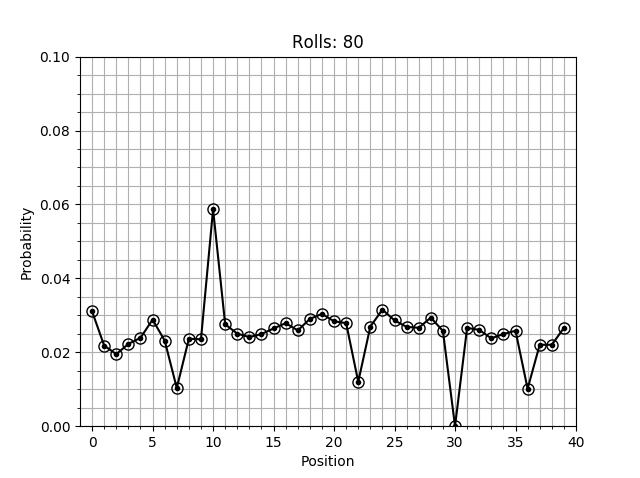

# Markov Monopoly

Simulates the movement of players around the board for a game of *US Standard 2008 Edition Monopoly*, using a Markov process, in order to model the likelihood of landing on each tile.

## Running the Script

The script was written for, and tested on, **Python 3.5.2**, **Numpy 1.16.3**, and **Matplotlib 3.0.3**. To ensure correct functionality, update Numpy and Matplotlib before running:
```bash
pip3 install --user --upgrade numpy
pip3 install --user --upgrade matplotlib
```
Then run with Python 3, or simply using
```bash
./monopoly.py
```

On execution, it should produce an animated plot with title counting the number of rolls. Upon closing the plot, the script will output the total probability and exit.

## Interpreting the Output



The plot displayed by the script represents the probability of finding any given player on a specific tile, after a certain number of rolls have been made by that player. The probability is shown on the vertical axis, for each of the tiles on the horizontal axis. The tiles are numbered from 0 (corresponding to the "Go" tile) clockwise around the board (in the direction of play) up until tile 39 (*Boardwalk*). The probability distribution starts before any rolls have been made, at which time the player has a 100% chance of being on the "Go" tile.

After turn 80 (or the turn given by `final_roll` - see *Modifying Output* section below), the simulation will cease, and black circles will be overlayed onto the probability distribution. These circles show the *limiting distribution* (as the number of rolls tends to infinity), obtained as the (normalized) eigenvector of the transition matrix corresponding to eigenvalue 1. Finally, upon closing the plot, the sum under the probability distribution will be output, as a consistency check (of course, this should be 1).

## Modifying the Script

### Adding & Modifying Transitions

The script contains a function `jump_to(A ,f, t, p)`. Once the initial transition matrix has been constructed (based on dice rolls alone), this function is used to add possible transitions (jumps) from one tile to another with a given probability. These are added based on the official *Monopoly* rules, and may include such things as a "Go to Jail" square, or "Chance" cards which send the player to another tile. The order in which these jumps are added matters, in that all possible transitions **to** any given tile should be established before adding a transition **from** that tile. As such, the jumps from the *Chance* tiles are added before the jumps from the *Community Chest* tiles, since one of the 16 *Chance* cards (if drawn on one of the 3 *Chance* tiles) may send the player (back 3 spaces) to a *Community Chest* tile.

### Modifying Output

The number of turns simulated may be changed simply be changing the global variable `final_roll` at the top of the script. The animation itself is all controlled by the `animate(A, p0, rolls, delay=50, limit=True)` function. The delay between frames is easily changed, as well as whether the limiting distribution is shown after the animation completes. 

### General Changes

All functions are well-documented, and the code is logically divided and commented where necessary. This should make understanding and modifying the code straightforward.

## Other Versions

The directory `old` contains an older version of the script, written in MATLAB (for version
R2017b). The script was converted to Python and Numpy for accessibility (since MATLAB is proprietary).

## Contributing

Pull requests are welcome - in fact, encouraged.

## Licence

This project is licensed under the [MIT](https://choosealicense.com/licenses/mit/) licence. 

All effort has been made to avoid infringing on copyright held by Parker Brothers or related corporations. It is believed that this project is general enough so as to be applicable to many board games, although Monopoly was used for testing. Should a holder of copyright claim wish for me to take this repository down, please raise an issue, and I will prompty do so. 
